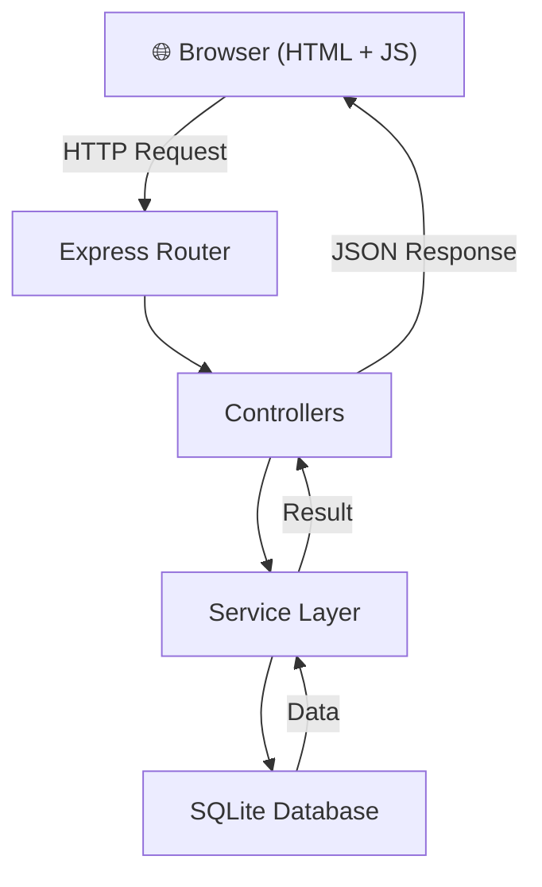
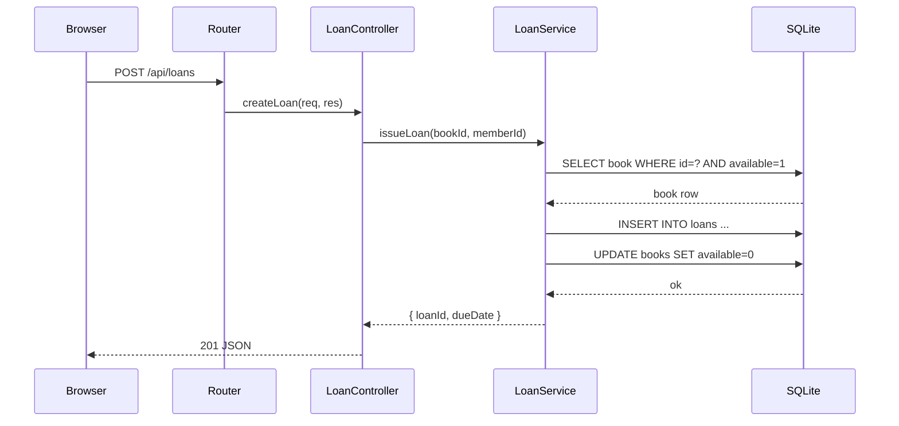
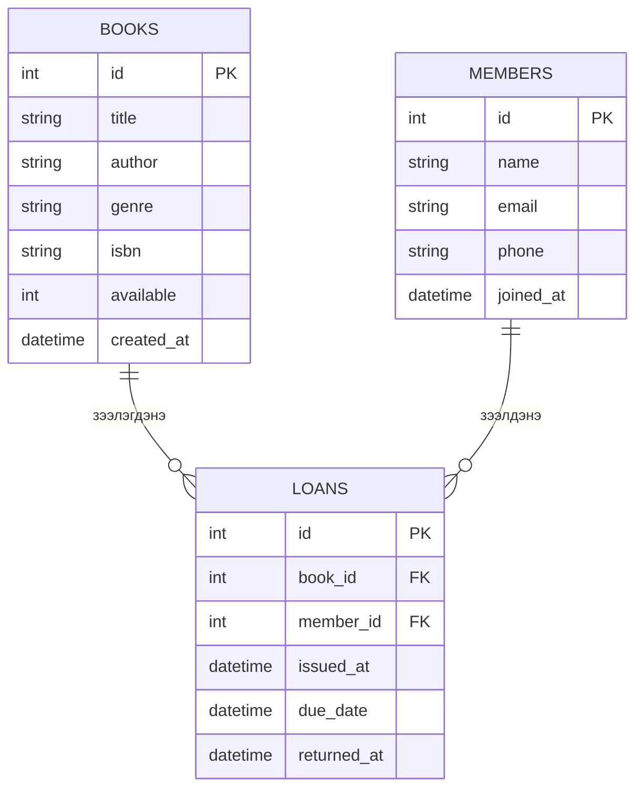

# Architecture — Mini Library

## Layer diagram



## Module тайлбар

| Module | Файл | Үүрэг |
|--------|------|-------|
| Server | `src/index.js` | Express app, port listen |
| Routes | `src/routes/*.js` | URL → Controller холболт |
| Controllers | `src/controllers/*.js` | Request/Response логик |
| Services | `src/services/*.js` | Бизнес логик |
| Models | `src/models/*.js` | Database query |
| Middleware | `src/middleware/` | Auth, error handler, logger |
| Static | `public/` | HTML, CSS, JS |

## Data flow — Ном зээлэх



## Database schema



## Directory бүтэц

```
bie-daalt-13/
├── CLAUDE.md
├── .claude/commands/
├── partA/
│   ├── PROJECT.md
│   ├── ARCHITECTURE.md
│   ├── STACK-COMPARISON.md
│   ├── README.md
│   ├── adr/0001-stack-decision.md
│   └── ai-sessions/plan.md
└── partB/
    ├── src/
    │   ├── index.js
    │   ├── db.js
    │   ├── routes/
    │   │   ├── books.js
    │   │   ├── members.js
    │   │   └── loans.js
    │   ├── controllers/
    │   │   ├── bookController.js
    │   │   ├── memberController.js
    │   │   └── loanController.js
    │   ├── services/
    │   │   ├── bookService.js
    │   │   ├── memberService.js
    │   │   └── loanService.js
    │   └── middleware/
    │       ├── errorHandler.js
    │       └── validate.js
    ├── public/
    │   ├── index.html
    │   ├── css/style.css
    │   └── js/app.js
    ├── tests/
    └── openapi.yaml
```
